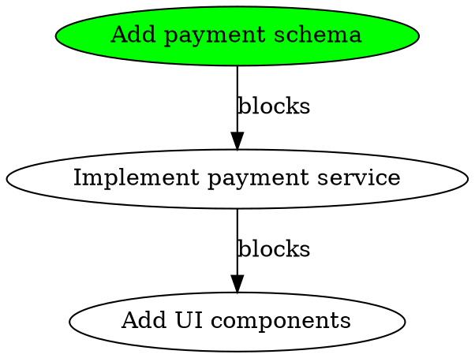

# knecht - Design Specification

## Overview

**knecht** is a lightweight, git-native task tracker designed for AI coding agents and developers. It focuses on task breakdown, dependency tracking, and discovering work during implementation.

Named after Joseph Knecht from Hermann Hesse's *The Glass Bead Game*, where "knecht" means "servant" in German - a tool that serves the developer.

## Design Goals

1. **Simplicity**: ~10 core commands, minimal configuration
2. **Git-native**: JSONL storage that commits with your code
3. **Fast**: Rust performance allows re-parsing on every command (no daemon)
4. **Dependency-aware**: Track what blocks what
5. **Agent-friendly**: JSON output, clear ready-work detection
6. **StoryTime integration**: Reference story IDs for context

## Core Concepts

### Task
A unit of work with:
- Unique ID (e.g., `task-a3f8`)
- Title and optional notes
- Status (open/done)
- Optional reference to a StoryTime story
- Optional parent task (for subtasks)
- Dependency links (blocked-by relationships)

### Dependency Types
Only two types to keep it simple:
1. **blocked-by**: Task X is blocked by Task Y (Y must be done first)
2. **parent-child**: Task X is a subtask of Task Y (hierarchical organization)

### Ready Work
Tasks that are:
- Status = open
- All tasks it's blocked-by are done
- Not a parent task with open children

## Data Model

### Task Structure
```rust
struct Task {
    id: String,              // e.g., "task-a3f8"
    title: String,
    notes: String,           // Optional detailed description
    status: TaskStatus,      // Open or Done
    story_id: Option<String>, // Reference to StoryTime story, e.g., "st-abc123"
    parent_id: Option<String>, // For subtasks
    blocked_by: Vec<String>, // IDs of tasks that block this one
    created_at: DateTime<Utc>,
    completed_at: Option<DateTime<Utc>>,
}

enum TaskStatus {
    Open,
    Done,
}
```

### Task ID Format
- Format: `task-{hash}`
- Hash: First 4-8 characters of a content-based hash (like git commits)
- Prevents merge conflicts when multiple people/agents create tasks
- Example: `task-a3f8`, `task-9b2c7e1a`

## Storage Format

### File Structure
```
.knecht/
├── tasks.jsonl          # All tasks (one JSON object per line)
└── .gitignore          # Auto-generated (empty, just marks directory)
```

### JSONL Format
Each line is a complete JSON object representing one task:

```jsonl
{"id":"task-a3f8","title":"Add payment schema","notes":"","status":"Open","story_id":"st-abc123","parent_id":null,"blocked_by":[],"created_at":"2026-01-05T20:30:00Z","completed_at":null}
{"id":"task-9b2c","title":"Implement payment service","notes":"Use Stripe API","status":"Open","story_id":"st-abc123","parent_id":null,"blocked_by":["task-a3f8"],"created_at":"2026-01-05T20:31:00Z","completed_at":null}
{"id":"task-f1d3","title":"Add tests","notes":"","status":"Done","story_id":"st-abc123","parent_id":null,"blocked_by":[],"created_at":"2026-01-05T20:32:00Z","completed_at":"2026-01-05T21:00:00Z"}
```

**Why JSONL?**
- Git-friendly: Line-based diffs work well
- Simple to parse: Read line-by-line
- No need for database: Fast enough to parse on every command
- Append-only by default: Just add new lines for updates

**Update Strategy:**
When updating a task, rewrite the entire file with updated task. This is fast enough for reasonable task counts (< 1000 tasks).

## Commands

### Core Commands

#### `knecht init`
Initialize knecht in current directory.

```bash
knecht init
```

**Behavior:**
- Create `.knecht/` directory
- Create empty `tasks.jsonl`
- Create `.knecht/.gitignore` (empty file)
- Output: "Initialized knecht in .knecht/"

#### `knecht task <title> [flags]`
Create a new task.

```bash
knecht task "Add payment schema" --story st-abc123
knecht task "Add tests" --notes "Cover edge cases"
knecht task "Fix bug in auth" --blocked-by task-a3f8
```

**Flags:**
- `--story <id>`: Link to StoryTime story
- `--notes <text>`: Detailed notes
- `--blocked-by <task-id>`: This task is blocked by another
- `--parent <task-id>`: This is a subtask of another
- `--json`: Output JSON

**Output (human):**
```
Created task-9b2c: Add payment schema
```

**Output (--json):**
```json
{"id":"task-9b2c","title":"Add payment schema","status":"Open","story_id":"st-abc123"}
```

#### `knecht subtask <title> --parent <task-id> [flags]`
Shorthand for creating a subtask.

```bash
knecht subtask "Add migration" --parent task-a3f8
```

Equivalent to: `knecht task "Add migration" --parent task-a3f8`

#### `knecht done <task-id>`
Mark a task as done.

```bash
knecht done task-a3f8
```

**Behavior:**
- Set status = Done
- Set completed_at = now
- Check if this unblocks any other tasks, report them

**Output:**
```
✓ task-a3f8: Add payment schema

Unblocked:
  task-9b2c: Implement payment service
```

#### `knecht reopen <task-id>`
Reopen a completed task.

```bash
knecht reopen task-a3f8
```

#### `knecht list [flags]`
List tasks with filters.

```bash
knecht list
knecht list --story st-abc123
knecht list --status open
knecht list --parent task-a3f8
```

**Flags:**
- `--story <id>`: Filter by story
- `--status <open|done>`: Filter by status
- `--parent <id>`: Show subtasks of a task
- `--json`: Output JSON

**Output (human):**
```
task-a3f8  ✓  Add payment schema
task-9b2c  ○  Implement payment service (blocked by task-a3f8)
task-f1d3  ○  Add tests
```

**Output (--json):**
```json
[
  {"id":"task-a3f8","title":"Add payment schema","status":"Done"},
  {"id":"task-9b2c","title":"Implement payment service","status":"Open","blocked_by":["task-a3f8"]},
  {"id":"task-f1d3","title":"Add tests","status":"Open","blocked_by":[]}
]
```

#### `knecht ready [flags]`
Show tasks that are ready to work on (no blockers).

```bash
knecht ready
knecht ready --story st-abc123
```

**Algorithm:**
1. Filter to status = Open
2. Exclude tasks where any blocked_by task is still Open
3. Exclude parent tasks that have open children
4. Sort by created_at (oldest first)

**Output:**
```
Ready to work:
  task-a3f8  Add payment schema
  task-f1d3  Add tests

Blocked (waiting):
  task-9b2c  Implement payment service (blocked by task-a3f8)
```

#### `knecht show <task-id>`
Show detailed information about a task.

```bash
knecht show task-a3f8
```

**Output:**
```
task-a3f8: Add payment schema

Status: Done
Story: st-abc123
Created: 2026-01-05 20:30:00 UTC
Completed: 2026-01-05 21:00:00 UTC

Notes:
  (none)

Blocks:
  task-9b2c: Implement payment service

Subtasks:
  (none)
```

#### `knecht block <task-id> <blocked-by-id>`
Create a blocking relationship.

```bash
knecht block task-9b2c task-a3f8
# task-9b2c is now blocked by task-a3f8
```

**Output:**
```
task-9b2c (Implement payment service) is now blocked by task-a3f8 (Add payment schema)
```

#### `knecht unblock <task-id> <blocked-by-id>`
Remove a blocking relationship.

```bash
knecht unblock task-9b2c task-a3f8
```

#### `knecht graph [flags]`
Visualize the dependency graph.

```bash
knecht graph
knecht graph --story st-abc123
knecht graph --format dot  # Graphviz DOT format
```

**Output (simple tree):**
```
task-a3f8 ✓ Add payment schema
  └─> task-9b2c ○ Implement payment service
        └─> task-c4e7 ○ Add UI components

task-f1d3 ○ Add tests
```

**Output (--format dot):**


#### `knecht update <task-id> [flags]`
Update task fields.

```bash
knecht update task-a3f8 --title "Add payment schema and migrations"
knecht update task-a3f8 --notes "Remember to add indexes"
knecht update task-a3f8 --story st-def456
```

**Flags:**
- `--title <text>`: Update title
- `--notes <text>`: Update notes
- `--story <id>`: Update story reference

### Story Commands

#### `knecht story <story-id>`
Show all tasks for a story, organized by status and dependencies.

```bash
knecht story st-abc123
```

**Output:**
```
Story: st-abc123

Ready (2):
  task-a3f8  Add payment schema
  task-f1d3  Add tests

Blocked (1):
  task-9b2c  Implement payment service
    blocked by: task-a3f8

Done (0):
  (none)
```

### Git Integration

#### `knecht commit <task-id> -m <message>`
Mark task done and create a git commit.

```bash
knecht commit task-a3f8 -m "Add payment schema"
```

**Behavior:**
1. Mark task done
2. Stage all changes: `git add -A`
3. Commit with message: `git commit -m "task-a3f8: Add payment schema"`
4. Show unblocked tasks

**Optional:** Could also support git hooks to auto-update tasks.

## Implementation Notes

### Language: Rust

**Key Dependencies:**
- `clap` - CLI argument parsing
- `serde` + `serde_json` - JSON serialization
- `chrono` - DateTime handling
- `anyhow` - Error handling
- `uuid` or `sha2` - For generating task IDs

### Project Structure
```
knecht/
├── Cargo.toml
├── src/
│   ├── main.rs           # CLI entry point
│   ├── commands/         # Command implementations
│   │   ├── mod.rs
│   │   ├── init.rs
│   │   ├── task.rs
│   │   ├── list.rs
│   │   ├── ready.rs
│   │   └── ...
│   ├── models/           # Data structures
│   │   ├── mod.rs
│   │   └── task.rs
│   ├── storage/          # JSONL reading/writing
│   │   ├── mod.rs
│   │   └── jsonl.rs
│   └── graph/            # Dependency resolution
│       ├── mod.rs
│       └── resolver.rs
└── tests/
    └── integration_tests.rs
```

### Storage Implementation

```rust
// storage/jsonl.rs
pub struct TaskStorage {
    path: PathBuf,
}

impl TaskStorage {
    pub fn new() -> Result<Self> {
        let path = PathBuf::from(".knecht/tasks.jsonl");
        Ok(Self { path })
    }

    pub fn load_all(&self) -> Result<Vec<Task>> {
        let file = File::open(&self.path)?;
        let reader = BufReader::new(file);
        
        reader
            .lines()
            .map(|line| {
                let line = line?;
                let task: Task = serde_json::from_str(&line)?;
                Ok(task)
            })
            .collect()
    }

    pub fn save_all(&self, tasks: &[Task]) -> Result<()> {
        let mut file = File::create(&self.path)?;
        for task in tasks {
            let json = serde_json::to_string(task)?;
            writeln!(file, "{}", json)?;
        }
        Ok(())
    }
}
```

### Dependency Resolution

```rust
// graph/resolver.rs
pub fn find_ready_tasks(tasks: &[Task]) -> Vec<&Task> {
    tasks
        .iter()
        .filter(|task| task.status == TaskStatus::Open)
        .filter(|task| is_unblocked(task, tasks))
        .filter(|task| !has_open_children(task, tasks))
        .collect()
}

fn is_unblocked(task: &Task, all_tasks: &[Task]) -> bool {
    task.blocked_by.iter().all(|blocker_id| {
        all_tasks
            .iter()
            .find(|t| t.id == *blocker_id)
            .map(|t| t.status == TaskStatus::Done)
            .unwrap_or(true) // If blocker doesn't exist, consider unblocked
    })
}

fn has_open_children(task: &Task, all_tasks: &[Task]) -> bool {
    all_tasks
        .iter()
        .any(|t| {
            t.parent_id.as_ref() == Some(&task.id) 
            && t.status == TaskStatus::Open
        })
}
```

### Task ID Generation

```rust
use sha2::{Sha256, Digest};

fn generate_task_id(title: &str, created_at: &DateTime<Utc>) -> String {
    let mut hasher = Sha256::new();
    hasher.update(title.as_bytes());
    hasher.update(created_at.to_rfc3339().as_bytes());
    
    let result = hasher.finalize();
    let hash = format!("{:x}", result);
    
    format!("task-{}", &hash[..8])
}
```

### CLI Output Formatting

```rust
// For human output
pub fn print_task_list(tasks: &[Task]) {
    for task in tasks {
        let status_icon = match task.status {
            TaskStatus::Done => "✓",
            TaskStatus::Open => "○",
        };
        
        let mut line = format!("{} {} {}", task.id, status_icon, task.title);
        
        if !task.blocked_by.is_empty() {
            let blockers = task.blocked_by.join(", ");
            line.push_str(&format!(" (blocked by {})", blockers));
        }
        
        println!("{}", line);
    }
}

// For JSON output
pub fn print_json(tasks: &[Task]) -> Result<()> {
    let json = serde_json::to_string_pretty(&tasks)?;
    println!("{}", json);
    Ok(())
}
```

## Example Workflows

### Workflow 1: Breaking Down a Story

```bash
# Start a new story from StoryTime
knecht task "Add payment processing" --story st-abc123

# Break it down into subtasks
knecht subtask "Research Stripe API" --parent task-a3f8
knecht subtask "Add payment schema" --parent task-a3f8
knecht subtask "Implement payment service" --parent task-a3f8
knecht subtask "Add UI components" --parent task-a3f8
knecht subtask "Add tests" --parent task-a3f8

# Add dependencies
knecht block task-c4e7 task-9b2c  # Service blocks UI
knecht block task-9b2c task-b5f1  # Schema blocks service

# See what's ready
knecht ready --story st-abc123
# Output: task-d2a9 (Research Stripe API), task-b5f1 (Add payment schema)
```

### Workflow 2: AI Agent Working Through Tasks

```bash
# Agent checks what's ready
knecht ready --json

# Picks a task and works on it
# ... does the work ...

# Marks it done
knecht done task-b5f1

# Checks what's newly unblocked
knecht ready --json
# Now task-9b2c is ready!
```

### Workflow 3: Discovered Work

```bash
# While implementing task-9b2c, discover a bug
knecht task "Fix race condition in callbacks" --story st-abc123 --notes "Found while implementing payment service"

# This new task blocks the UI work
knecht block task-c4e7 task-x7y9
```

## Future Enhancements (Out of Scope for v1)

These could be added later but are not essential:

- Task search by text query
- Filtering by date ranges
- Labels/tags
- Task comments/history
- Cycle detection in dependencies
- Export to other formats (Markdown, CSV)
- Web UI viewer
- Git hooks for auto-update
- Config file for defaults
- Template system for common task patterns

## Success Criteria

A successful v1 implementation should:

1. ✅ Create, update, list, and complete tasks
2. ✅ Track blocking dependencies
3. ✅ Identify ready work automatically
4. ✅ Support hierarchical subtasks
5. ✅ Reference StoryTime stories
6. ✅ Output JSON for agent consumption
7. ✅ Store data in git-friendly JSONL
8. ✅ Handle basic git workflow (commit command)
9. ✅ Run fast (< 100ms for most commands)
10. ✅ Work without configuration (sensible defaults)

## Non-Goals

These are explicitly not goals for knecht:

- ❌ Team collaboration features (that's StoryTime's job)
- ❌ Time tracking or reporting
- ❌ Complex querying or analytics
- ❌ Integration with external tools (Jira, GitHub Issues, etc.)
- ❌ Background daemons or services
- ❌ Database beyond simple JSONL
- ❌ User accounts or authentication
- ❌ Real-time sync between machines

---

## Getting Started (For Implementer)

1. Create new Rust project: `cargo new knecht`
2. Add dependencies to `Cargo.toml`
3. Implement `Task` struct and serialization
4. Implement JSONL storage layer
5. Implement `init` command
6. Implement `task` command
7. Implement `list` command
8. Implement `done` command
9. Implement dependency resolution for `ready` command
10. Implement remaining commands
11. Add tests
12. Polish output formatting
13. Write README and usage docs

Good luck! 🎯
